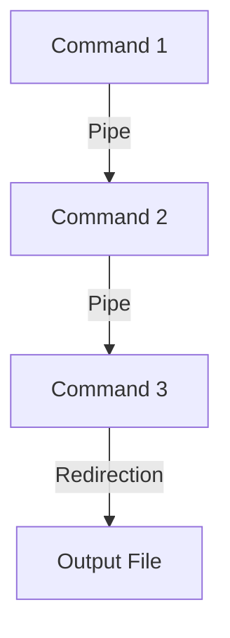

#### Combined Use of [[Redirections]] and [[Pipes]]

Combining pipes with redirections can create complex command sequences, enabling sophisticated operations with a single command line. Here's a detailed breakdown with examples:

1. **Syntax**

```
command1 | command2 | command3 > output_file
```

 **Diagram**:



2. **Example with Mock Data**

Let's reuse our "data.txt" file and search for a particular string, sort the results, remove duplicates, and redirect the output to a new file:

```
$ grep "apple" data.txt | sort | uniq > output.txt
```

The command sequence does the following:

- `grep "apple" data.txt`: Searches for the string "apple" in "data.txt".
- `sort`: Sorts the output of the grep command.
- `uniq`: Removes duplicate lines from the sorted output.
- `> output.txt`: Redirects the final output to "output.txt".
