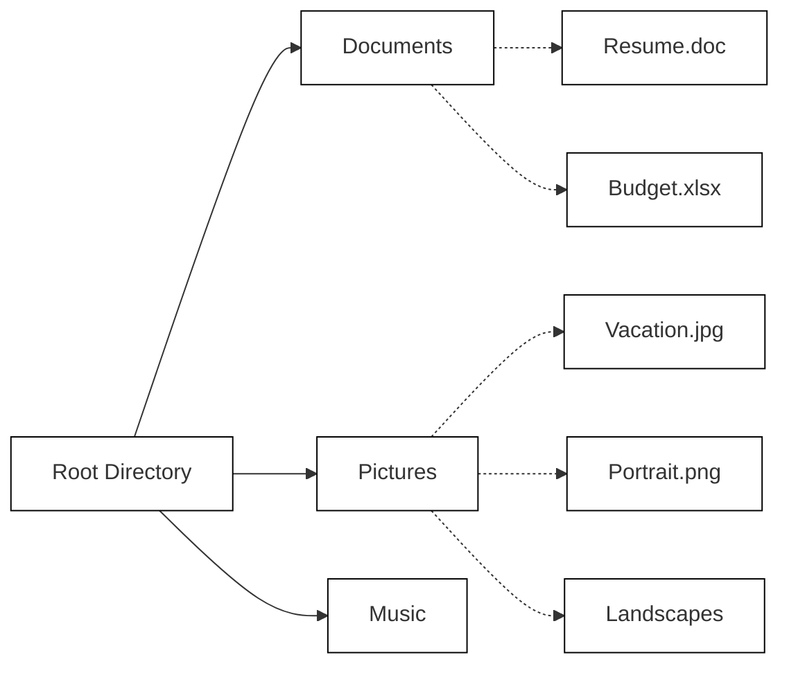

### File Structures

Files in a filesystem are organized in a hierarchical structure. This structure starts with a root directory, which contains subdirectories and files. Each subdirectory can further contain other subdirectories and files, forming a tree-like structure.

Here's a visualization of a simple file structure:



```bash
.
├── Documents
├── Pictures/
│   ├── Portrait.png
│   ├── Vacation.jpg
│   └── Landscapes/
└── Music/
```
