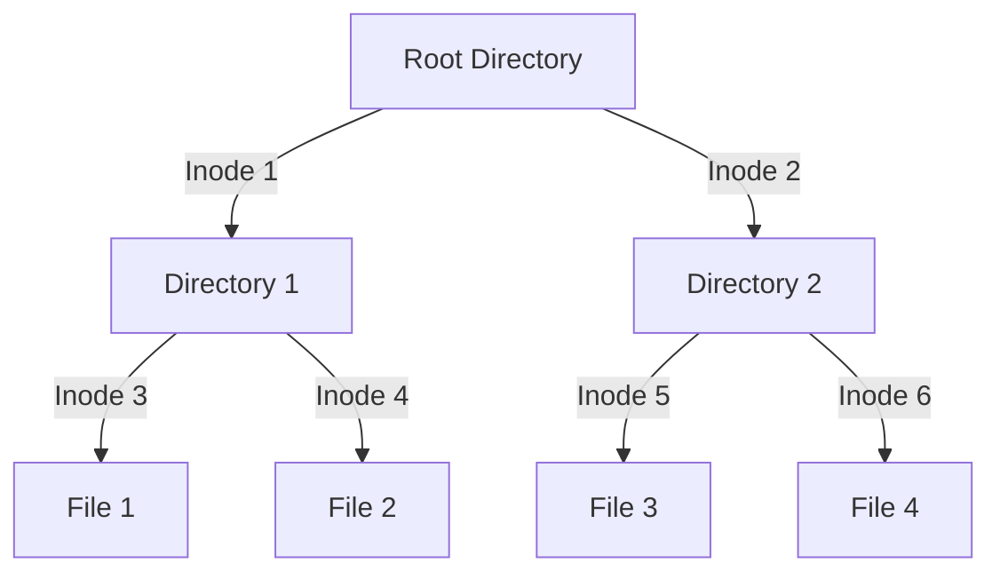

### File Systems: Inodes, Directories, and Files

In a Unix-like file system, [[files]] and [[directories]] are organized in a [[File structures|hierarchical structure]]. Let's break down this structure into several components:

1. **Inodes**: An inode contains metadata about a file or directory (like permissions, ownership, and type) but not its name or data. Each file or directory has a unique inode.

    ```mermaid
    graph TD;
        A[Inode] -->|Contains| B[Metadata]
        B --> C1[Ownership]
        B --> C2[Permissions]
        B --> C3[Type]
        B --> C4[Size]
        B --> C5[Time Stamps]
    ```

2. **Directories**: A directory is a special kind of file that contains a list of file names and their corresponding inode numbers. 

    ```mermaid
    graph TD;
        A[Directory] -->|Contains| B[List of File Names and Inode Numbers]
        B --> C1[File1 - Inode1]
        B --> C2[File2 - Inode2]
        B --> C3[File3 - Inode3]
    ```

3. **Files**: Files contain the actual data and are pointed to by inodes.

    ```mermaid
    graph TD;
        A[File] -->|Pointed by| B[Inode]
        A -->|Contains| C[Data]
    ```

----

### Inodes and Directories

An inode is a data structure that stores metadata about files and directories on a Unix-like operating system. Each inode contains information about a file or directory, such as its size, owner, and permissions. The inode number is a unique identifier for files and directories within a filesystem.

Here's a visualization to illustrate the relationship between inodes, directories, and files:


