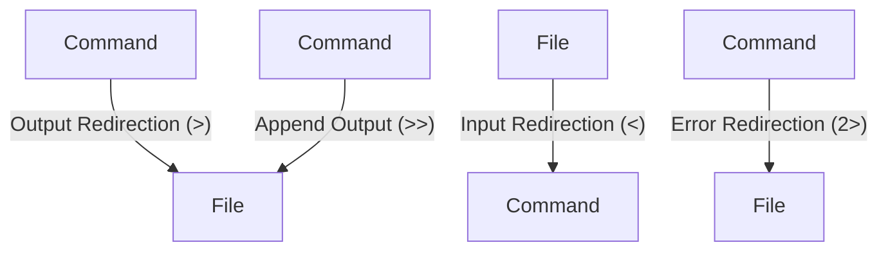

### Redirections in UNIX

In [[Unix]]-like operating systems, redirections are fundamental for controlling data flow between processes or between [[processes]] and [[files]]. They facilitate the alteration of standard input/output channels of a command. Let's dive deep into each type of redirection:



#### 1. Standard Output (stdout)

Standard output, also known as stdout, is the stream where a program writes its output data. The program doesn't need to know the destination of the output, which can be another program, a terminal display, or a file. In Unix and Unix-like operating systems, you can redirect stdout using the `>` and `>>` operators.

##### 1.1 Output Redirection (`>`)

- **Operator**: `>`
- **Usage**: To create a new file with the output or overwrite an existing file.
- **Example**:

```sh
# The following command will create a new file named "hello.txt" and writes "Hello World" into it.
echo "Hello World" > hello.txt
```

##### 1.2 Append Output (`>>`)

- **Operator**: `>>`
- **Usage**: To append the output to an existing file instead of overwriting it.
- **Example**:

```sh
# This command will append "Welcome to Unix" to the "hello.txt" file without deleting the existing content.
echo "Welcome to Unix" >> hello.txt
```

#### 2. Standard Input (stdin)

Standard input, abbreviated as stdin, is the input data stream for a program. It's used to read data from a source, such as a file, and supply it to the program. In Unix-like systems, you can redirect stdin using the `<` operator.
##### 2.1 Input Redirection (`<`)

- **Operator**: `<`
- **Usage**: To use the content of a file as the input for a command, effectively directing the contents of a file to the command's standard input.
- **Mock Data**:
  Let's assume we have a file named `names.txt` containing the following data:
  ```
  Charlie
  Alice
  Bob
  ```

- **Example**:

```sh
# Create a file named "names.txt" with the list of names
echo -e "Charlie\nAlice\nBob" > names.txt

# Use the "sort" command to sort the names in alphabetical order by redirecting the contents of "names.txt" as input.
sort < names.txt

# The output will be:
# Alice
# Bob
# Charlie
```

This example illustrates how to create a file with a list of names and then use the input redirection operator (`<`) to sort the names in alphabetical order. The `sort` command reads the contents of `names.txt` as if they were input directly from the terminal.

#### 3. Standard Error (stderr)

Standard error, denoted as stderr, is another output stream typically used by programs to output error messages or diagnostics. It can be redirected using the `2>` operator to separate error messages from standard output.

##### 3.1 Error Redirection (`2>`)

- **Operator**: `2>`
- **Usage**: To redirect the error messages generated by a command to a file.
- **Example**:

```sh
# If "no_file.txt" does not exist, this command will write an error message to "error.txt".
cat no_file.txt 2> error.txt
```
